# 🏆 Balón de Oro API

API REST construida en Go (únicamente librería estándar) para gestionar el historial de ganadores del **Balón de Oro** desde el año 2000.

**URL base:** `https://bombardeen-palencia.xyz/angel/ejercicio_4`  
**Puerto:** `24725`  
**Tecnología:** Go 1.22 — sin frameworks externos  
**Autor:** Angel Gabriel Sanabria Morales — 24725

---

## Estructura del proyecto

```
.
├── main.go                      # Entry point y routing
├── go.mod
├── Dockerfile
├── docker-compose.yml.example
├── data/
│   └── winners.json             # Persistencia en disco
├── handlers/
│   └── winners.go               # Lógica de cada endpoint
├── models/
│   └── winner.go                # Struct Winner
├── store/
│   └── store.go                 # CRUD thread-safe con persistencia
└── docs/                        # Capturas de evidencia
```

---

## Modelo de datos

```json
{
  "id":                1,
  "player":            "Luis Figo",
  "nationality":       "Portugal",
  "club":              "Real Madrid",
  "year":              2000,
  "votes":             561,
  "position":          "Forward",
  "goals_that_season": 11
}
```

Valores válidos para `position`: `Forward` | `Midfielder` | `Defender` | `Goalkeeper`

---

## Endpoints

| Método   | Ruta                    | Descripción                           |
|----------|-------------------------|---------------------------------------|
| `GET`    | `/api/ping`             | Health check                          |
| `GET`    | `/api/winners`          | Listar todos / filtrar con queries    |
| `GET`    | `/api/winners/{id}`     | Obtener ganador por path parameter    |
| `POST`   | `/api/winners`          | Registrar nuevo ganador               |
| `PUT`    | `/api/winners/{id}`     | Reemplazar registro completo          |
| `PATCH`  | `/api/winners/{id}`     | Actualizar campos parcialmente        |
| `DELETE` | `/api/winners/{id}`     | Eliminar registro                     |

---

## Query Parameters en `GET /api/winners`

| Parámetro     | Tipo   | Descripción                                    |
|---------------|--------|------------------------------------------------|
| `id`          | int    | Buscar por ID exacto                           |
| `player`      | string | Filtrar por nombre (parcial, case-insensitive) |
| `nationality` | string | Filtrar por nacionalidad                       |
| `club`        | string | Filtrar por club (parcial)                     |
| `year`        | int    | Filtrar por año de entrega                     |
| `position`    | string | Filtrar por posición                           |
| `min_goals`   | int    | Filtrar por mínimo de goles en esa temporada   |

Todos los filtros son combinables entre sí.

---

## Ejemplos de uso

### Health check
```bash
curl https://bombardeen-palencia.xyz/angel/ejercicio_4/api/ping
```

### GET — Todos los ganadores
```bash
curl https://bombardeen-palencia.xyz/angel/ejercicio_4/api/winners
```

### GET — Por query parameter
```bash
curl "https://bombardeen-palencia.xyz/angel/ejercicio_4/api/winners?id=6"
```

### GET — Por path parameter
```bash
curl https://bombardeen-palencia.xyz/angel/ejercicio_4/api/winners/6
```

### GET — Filtros combinados
```bash
curl "https://bombardeen-palencia.xyz/angel/ejercicio_4/api/winners?nationality=Argentina&position=Forward&min_goals=50"
```

### POST — Registrar nuevo ganador
```bash
curl -X POST https://bombardeen-palencia.xyz/angel/ejercicio_4/api/winners \
  -H "Content-Type: application/json" \
  -d '{
    "player": "Vinicius Jr.",
    "nationality": "Brazil",
    "club": "Real Madrid",
    "year": 2025,
    "votes": 650,
    "position": "Forward",
    "goals_that_season": 26
  }'
```

### PUT — Reemplazar registro completo
```bash
curl -X PUT https://bombardeen-palencia.xyz/angel/ejercicio_4/api/winners/1 \
  -H "Content-Type: application/json" \
  -d '{
    "player": "Luis Figo",
    "nationality": "Portugal",
    "club": "Real Madrid",
    "year": 2000,
    "votes": 600,
    "position": "Forward",
    "goals_that_season": 11
  }'
```

### PATCH — Actualizar campo parcial
```bash
curl -X PATCH https://bombardeen-palencia.xyz/angel/ejercicio_4/api/winners/1 \
  -H "Content-Type: application/json" \
  -d '{"votes": 999}'
```

### DELETE — Eliminar registro
```bash
curl -X DELETE https://bombardeen-palencia.xyz/angel/ejercicio_4/api/winners/26
```

---

## Casos de error

### 404 — No encontrado
```bash
curl https://bombardeen-palencia.xyz/angel/ejercicio_4/api/winners/999
```
```json
{"error":"Not Found","code":404,"message":"winner not found"}
```

### 422 — Validación fallida
```bash
curl -X POST https://bombardeen-palencia.xyz/angel/ejercicio_4/api/winners \
  -H "Content-Type: application/json" \
  -d '{"player":"","nationality":"Brazil","club":"PSG","year":2025,"votes":500,"position":"Forward","goals_that_season":20}'
```
```json
{"error":"Unprocessable Entity","code":422,"message":"player is required"}
```

### 400 — Campo desconocido en PATCH
```bash
curl -X PATCH https://bombardeen-palencia.xyz/angel/ejercicio_4/api/winners/1 \
  -H "Content-Type: application/json" \
  -d '{"unknown_field": "value"}'
```
```json
{"error":"Bad Request","code":400,"message":"unknown field: unknown_field"}
```

---

## Formato de respuesta

**Éxito:**
```json
{ "data": { ... } }
```

**Error:**
```json
{ "error": "Not Found", "code": 404, "message": "winner not found" }
```

---

## Validaciones

| Campo               | Regla                                             |
|---------------------|---------------------------------------------------|
| `player`            | Requerido, no vacío                               |
| `nationality`       | Requerido, no vacío                               |
| `club`              | Requerido, no vacío                               |
| `year`              | Entre 1956 y 2100                                 |
| `votes`             | No negativo                                       |
| `position`          | `Forward`, `Midfielder`, `Defender`, `Goalkeeper` |
| `goals_that_season` | No negativo                                       |

---

## Persistencia

Cada escritura (POST, PUT, PATCH, DELETE) guarda los cambios en `data/winners.json` inmediatamente, con mutex para garantizar thread-safety.

---

## Ejecución

### Con Docker
```bash
cp docker-compose.yml.example docker-compose.yml
docker compose up --build
```

### Sin Docker
```bash
go run .
```

Servidor disponible en el puerto `24725`.

---

## Evidencia

### Servidor corriendo
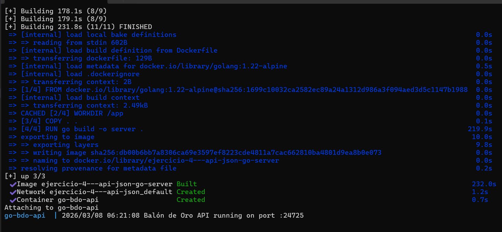

### GET — Todos los ganadores
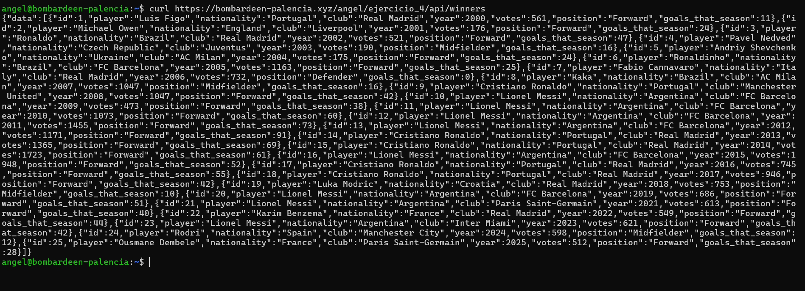

### GET — Query parameter
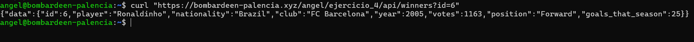

### GET — Path parameter
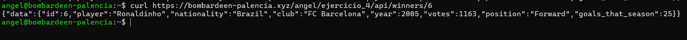

### GET — Filtros combinados
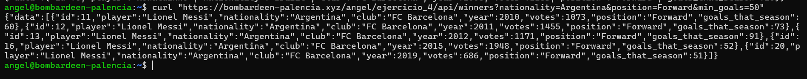

### POST — Nuevo ganador
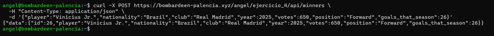

### PUT — Reemplazar registro
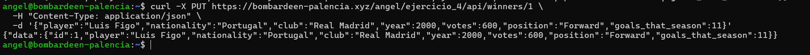

### PATCH — Actualización parcial
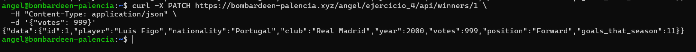

### DELETE — Eliminar registro
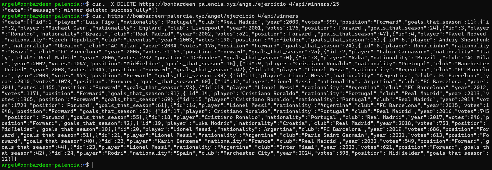

### Error 404
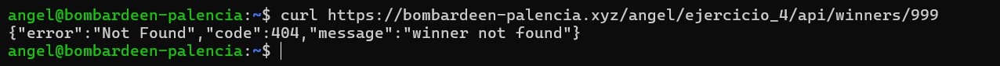

### Error 422
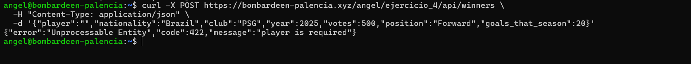
